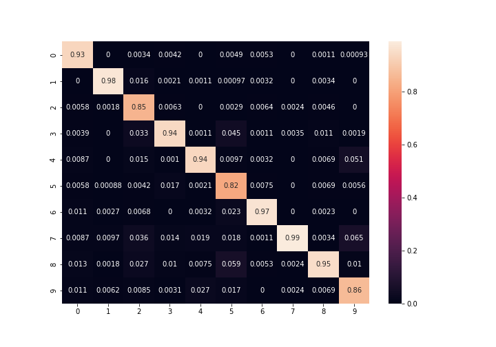

# Deep Learning Implementation using Numpy from scratch

## 딥러닝 네트워크의 깊은 이해를 위해 Python Numpy만을 사용해 직접 구현함. pyTorch, Keras와 비슷하게 Layer Module 구조로 구성. Model, Test용 데이터로더 포함

### Directory Tree / Description
```
|-- Dockerfile # Docker 생성을 위한 Dockerfile
|-- docker_build.sh # docker image build
|-- docker_run.sh # docker container run
|-- dataloader # 모듈 테스트용 data loader가 든 directory
|   |-- caption_data.py
|   |-- mnist.py
|   `-- text.py
|-- datasets
|   `-- mnist
|       |-- t10k-images.idx3-ubyte
|       |-- t10k-labels.idx1-ubyte
|       |-- train-images.idx3-ubyte
|       `-- train-labels.idx1-ubyte
|-- images # Visualization을 위한 Figure들
|   |-- confusion_matrix_nn5model2.png
|   |-- confusion_matrix_nn5model2_bak.png
|   |-- loss_graph_nn5model2.png
|   `-- loss_graph_nn5model2_bak.png
|-- modules # Layer들이 든 directory
|   |-- Add.py
|   |-- AvgPool2d.py
|   |-- Concat.py
|   |-- Conv2d.py
|   |-- Flatten.py
|   |-- LinearLayer.py
|   |-- Relu.py
|   |-- Rnn.py
|   |-- Softmax.py
|   |-- SoftmaxCrossEntropy.py
|   |-- Tanh.py
|-- models # 직접 구현한 module을 이용해 구현한 모델
|   |-- Cnn.py
|   |-- ImageCaptioning.py
|-- CNN_MNIST.py # 구현한 CNN모델을 테스트하기 위한 training, testing 코드
|-- README.md

```

### Train / Test Result for MNIST Dataset With CNN Classifier

#### Confision Matix
  
  


---

### Requirements
- Docker

### Get Started
```
bash docker_build.sh
bash docker_run.sh
```
- In container, Test CNN Model
```
python3 CNN_MNIST.py
```

### Layer Module Description
- [/modules](https://github.com/pikabite/dl_using_np/blob/master/modules/)
    - [Add.py](https://github.com/pikabite/dl_using_np/blob/master/modules/Add.py)
    - [AvgPool2d.py](https://github.com/pikabite/dl_using_np/blob/master/modules/AvgPool2d.py)
    - [Concat.py](https://github.com/pikabite/dl_using_np/blob/master/modules/Concat.py)
    - [Conv2d.py](https://github.com/pikabite/dl_using_np/blob/master/modules/Conv2d.py)
    - [Flatten.py](https://github.com/pikabite/dl_using_np/blob/master/modules/Flatten.py)
    - [LinearLayer.py](https://github.com/pikabite/dl_using_np/blob/master/modules/LinearLayer.py)
    - [Relu.py](https://github.com/pikabite/dl_using_np/blob/master/modules/Relu.py)
    - [Rnn.py](https://github.com/pikabite/dl_using_np/blob/master/modules/Rnn.py)
    - [Softmax.py](https://github.com/pikabite/dl_using_np/blob/master/modules/Softmax.py)
    - [SoftmaxCrossEntropy.py](https://github.com/pikabite/dl_using_np/blob/master/modulesSoftmaxCrossEntropy.py/)
    - [Tanh.py](https://github.com/pikabite/dl_using_np/blob/master/modules/Tanh.py)
